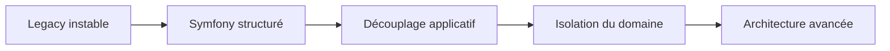
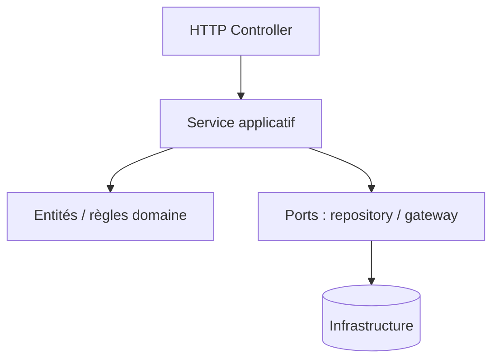
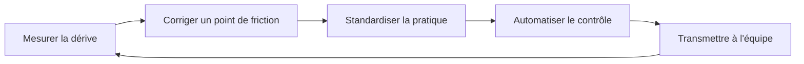

Architecte backend PHP / Symfony, j'interviens souvent sur des applications avec une dette technique avancée :

- fichiers procéduraux très volumineux
- logique métier dispersée
- couplage fort entre HTTP, persistence et règles métier
- usage partiel des services Symfony
- tentative de DDD amorcée mais non stabilisée

Dans ce contexte, la priorité n'est pas d'imposer une architecture idéale. La priorité est de reprendre le contrôle, collectivement.

## Vision : l'équipe avant le schéma idéal

Un système ne devient pas sain par décision individuelle. Il devient sain quand l'équipe adopte un cadre commun.

Passer d'un legacy chaotique à une architecture hexagonale stricte en une étape est rarement réaliste.



Cette trajectoire est progressive. Elle doit être comprise et portée par l'équipe.

## Méthode : sécuriser, structurer, aligner

### 1. Stabiliser le terrain

- analyse statique progressive
- intégration continue systématique
- standards de code partagés
- tests ciblés sur les flux critiques

Objectif : protéger l'équipe contre la dérive.

### 2. Revenir à un Symfony maîtrisé

Avant toute sophistication :

- contrôleurs limités à l'orchestration
- services applicatifs explicites
- injection de dépendances stricte
- responsabilités clairement isolées

```php
final class GenerateInvoiceHandler
{
    public function __construct(
        private InvoiceRepository $invoices,
        private PaymentGateway $paymentGateway
    ) {}

    public function handle(GenerateInvoiceCommand $command): void
    {
        $invoice = Invoice::fromOrder($command->order());
        $this->invoices->save($invoice);
        $this->paymentGateway->charge($invoice);
    }
}
```

Ce type de structuration rend le code lisible et réduit la dépendance aux experts historiques.

### 3. Aligner les pratiques

Je pousse une discipline technique partagée :

- architecture claire avant sophistication
- réduction systématique du couplage
- SOLID appliqué pragmatiquement
- séparation stricte des responsabilités
- automatisation comme garde-fou permanent



La qualité n'est pas une contrainte individuelle. C'est une responsabilité collective.

## Boucle d'amélioration continue



Moderniser un legacy n'est pas un acte héroïque. C'est un travail méthodique, partagé et assumé.
